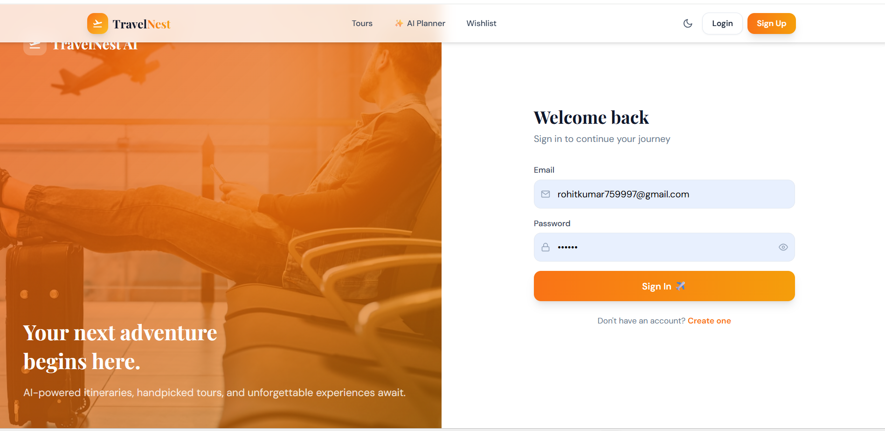
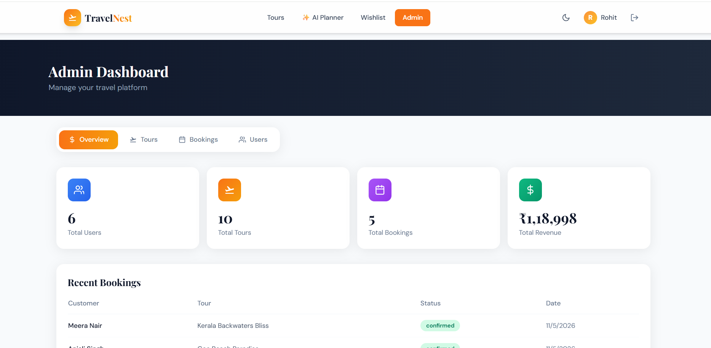
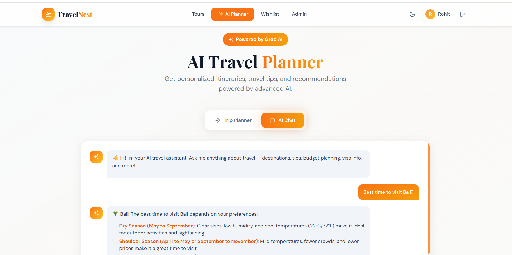

# ✈️ TravelNest AI — AI Powered MERN Travel Platform


A modern **AI-powered Travel Booking Web Application** built using the **MERN Stack**, **Groq AI**, and a responsive UI. Users can browse tours, book trips, manage wishlists, write reviews, and generate personalized travel itineraries using AI.

---

# 🌐 Live Demo

### 🚀 Frontend
https://travel-nest-ai-five.vercel.app

### ⚙️ Backend API
https://travelnest-ai-backend-0z1j.onrender.com/api

---

# 🚀 Tech Stack

| Layer | Technology |
|--------|------------|
| Frontend | React.js (Vite), Tailwind CSS |
| Backend | Node.js, Express.js |
| Database | MongoDB Atlas, Mongoose |
| Authentication | JWT + bcrypt |
| AI | Groq AI (Llama 3) |
| State Management | Zustand |
| HTTP Client | Axios |
| Deployment | Vercel + Render |

---

# ✨ Features

## 👤 User

- 🔐 Secure Signup/Login
- 🌍 Browse Travel Destinations
- 📄 Tour Details
- ❤️ Wishlist
- 📅 Tour Booking
- ⭐ Reviews & Ratings
- 👤 User Dashboard
- 🤖 AI Trip Planner
- 💬 AI Travel Chat
- 🌙 Dark Mode
- 📱 Fully Responsive

---

## 👨‍💼 Admin

- 📊 Dashboard
- ➕ Add Tours
- ✏️ Edit Tours
- ❌ Delete Tours
- 👥 Manage Users
- 📅 Manage Bookings
- 📈 View Statistics

---

# 📂 Project Structure

```text
travelnest-ai/
│
├── backend/
│   ├── models/
│   ├── routes/
│   ├── middleware/
│   ├── uploads/
│   ├── .env
│   ├── .gitignore
│   ├── package.json
│   ├── package-lock.json
│   ├── server.js
│   └── seed.js
│
├── frontend/
│   ├── public/
│   ├── src/
│   ├── .env
│   ├── .gitignore
│   ├── package.json
│   ├── package-lock.json
│   ├── vite.config.js
│   └── index.html
│
├── screenshots/
│   ├── home.png
│   ├── login.png
│   ├── signup.png
│   ├── tours.png
│   ├── booking.png
│   ├── dashboard.png
│   └── ai-planner.png
│
├── .gitignore
├── LICENSE
└── README.md
```

---

# ⚙️ Installation

## Clone Repository

```bash
git clone https://github.com/Rohitkumar968/travelnest-ai.git

cd travelnest-ai
```

---

## Backend Setup

```bash
cd backend

npm install

npm run dev
```

---

## Frontend Setup

```bash
cd frontend

npm install

npm run dev
```

---

# 🔑 Environment Variables

## Backend (.env)

```env
PORT=5000
MONGODB_URI=your_mongodb_uri
JWT_SECRET=your_secret_key
GROQ_API_KEY=your_groq_api_key
```

## Frontend (.env)

```env
VITE_API_URL=https://travelnest-ai-backend-0z1j.onrender.com/api
```

---

# 📡 API Endpoints

| Method | Route | Description |
|---------|-------|-------------|
| POST | /api/auth/signup | Register User |
| POST | /api/auth/login | Login User |
| GET | /api/auth/me | Current User |
| GET | /api/tours | Get Tours |
| GET | /api/tours/:id | Tour Details |
| POST | /api/bookings | Book Tour |
| GET | /api/bookings/my | My Bookings |
| GET | /api/wishlist | Wishlist |
| POST | /api/wishlist/toggle | Toggle Wishlist |
| POST | /api/reviews | Add Review |
| GET | /api/admin/stats | Admin Stats |
| POST | /api/ai/travel | AI Trip Planner |
| POST | /api/ai/chat | AI Travel Chat |

---

# 🤖 AI Features

- ✨ AI Trip Planner
- 💬 AI Travel Chat
- 📍 Personalized Itinerary
- 💰 Budget-Based Recommendations

---

# 🚀 Deployment

| Service | Platform |
|----------|----------|
| Frontend | Vercel |
| Backend | Render |
| Database | MongoDB Atlas |

---

# 📸 Screenshots

## 🏠 Home Page


---

## 🔐 Login Page



---

## 📝 Signup Page


---

## 🌍 Tours Page


---

## 📅 Booking Page


---

## 👤 Dashboard



---

## 🤖 AI Planner



---

# 👨‍💻 Author

**Rohit Kumar**

GitHub: https://github.com/Rohitkumar968

---

# ⭐ Support

If you found this project helpful, please consider giving it a ⭐ on GitHub.